## Part 1. Установка ОС

Установка Ubuntu 20.04 Server LTS без графического интерфейса. 
Скриншот версии Ubuntu

`cat /etc/issue`

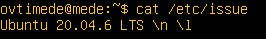

## Part 2. Создание пользователя

Создание пользователя, отличного от созданного при установке. 
`sudo adduser deathlord`

Пользователь добавлен в группу adm.

`sudo usermod -aG adm deathlord`

Скриншот вызова команды для создания пользователя.

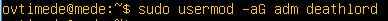

Новый пользователь в выводе команды
`cat /etc/passwd`

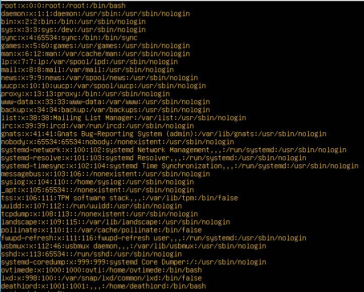

## Part 3. Настройка сети ОС

Название машины вида user-1.

`sudo hostnamectl set-hostname user-1`

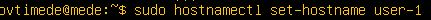

Установление временной зоны, соответствующей текущему местоположению.

`sudo timedatectl set-timezone Europe/Moscow`

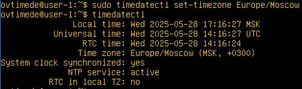

Названия сетевых интерфейсов с помощью консольной команды.

`ip l`

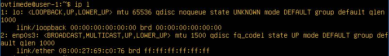

Интерфейс lo (loopback device) в Linux — виртуальный интерфейс, который существует по умолчанию. В отличие от обычных сетевых интерфейсов, он не привязан к физическому оборудованию и не имеет физических кабелей. 

Используя консольную команду, получаем ip адрес устройства от DHCP-сервера.

`sudo dhclient -v`

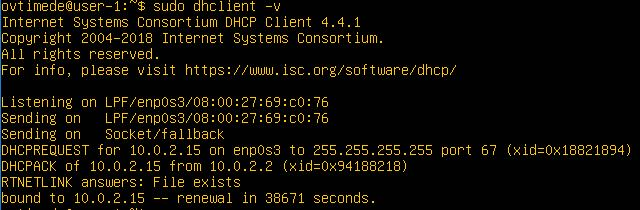

DHCP (Dynamic Host Configuration Protocol — протокол динамической настройки узла) — сетевой протокол, позволяющий сетевым устройствам автоматически получать IP-адрес и другие параметры, необходимые для работы в сети TCP/IP. Данный протокол работает по модели «клиент-сервер». Для автоматической конфигурации компьютер-клиент на этапе конфигурации сетевого устройства обращается к так называемому серверу DHCP и получает от него нужные параметры.  

внешний ip-адрес шлюза:

`curl ifconfig.co` 

внутренний IP-адрес шлюза:

`ip r`  

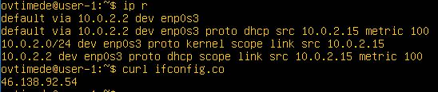

Статичные (заданные вручную, а не полученные от DHCP-сервера) настройки ip, gw, dns (используй публичный DNS-серверы, например 1.1.1.1 или 8.8.8.8).

`sudo vim /etc/netplan/00-installer-config.yaml`

`sudo netplan apply`

Перезагрузка виртуальной машины. 

`sudo reboot`

Статичные сетевые настройки (ip, gw, dns) соответствуют заданным в предыдущем пункте. Пропингуем удаленные хосты 1.1.1.1 и ya.ru. В выводе команды должна быть фраза «0% packet loss».

`ping ya.ru` `ping 1.1.1.1`

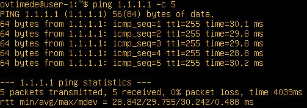

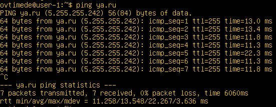

## Part 4. Обновление ОС

Обновление системных пакетов до последней на момент выполнения задания версии. После обновления системных пакетов, если ввести команду обновления повторно, должно появиться сообщение о том, что обновления отсутствуют.

`sudo apt-get upgrade`

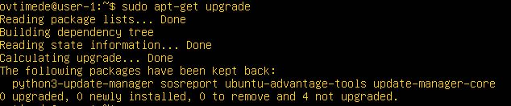

## Part 5. Использование команды sudo

Разрешение пользователю, созданному в Part 2,выполнять команду sudo.

`sudo usermod -aG sudo deathlord`

sudo (Substitute User and do, дословно «подменить пользователя и выполнить») — программа для системного администрирования UNIX-систем, позволяющая делегировать те или иные привилегированные ресурсы пользователям с ведением протокола работы.

Смена hostname ОС от имени пользователя, созданного в пункте Part 2 (используя sudo).

`su deathlord`

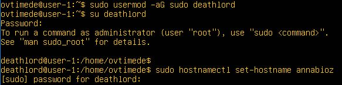

`hostnamectl`

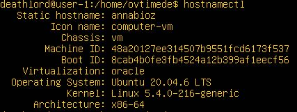

## Part 6. Установка и настройка службы времени

Настройка службы автоматической синхронизации времени.

Вывод следующей команды должен содержать NTPSynchronized=yes:
timedatectl show
Скрины с корректным временем и выводом команды в отчёт:

`timedatectl show`

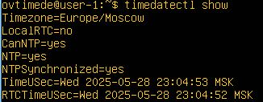

## Part 7. Установка и использование текстовых редакторов

Установка текстовых редакторов VIM, NANO, JOE.

`sudo apt install joe`

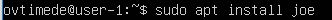

Используя каждый из трех выбранных редакторов, создаем файл test_X.txt, где X — название редактора, в котором создан файл. 

`vim test_VIM.txt`

`nano test_NANO.txt`

`joe test_JOE.txt`

В файле - никнейм, закрываем файл с сохранением изменений.

VIM: :wq, сохраняем и закрываем

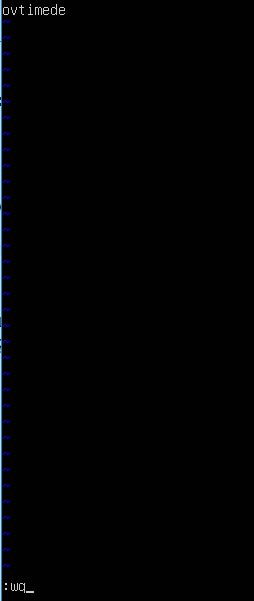

NANO: Ctrl+W, Ctrl+X, сохраняем и закрываем

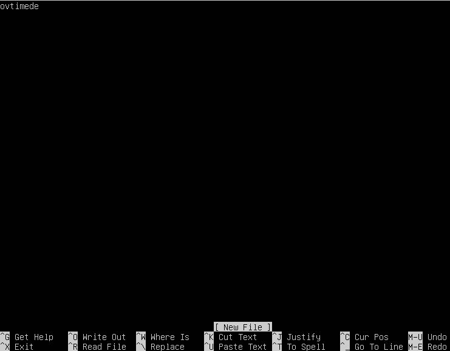

JOE: Ctrl+KX, сохраняем и закрываем

Используя каждый из трех выбранных редакторов, открываем файл на редактирование, отредактируем файл, заменив никнейм на строку «21 School 21», закрываем файл без сохранения изменений.
В отчёте скриншоты:
Из каждого редактора с содержимым файла после редактирования.
В отчёте команды для выхода без сохранения изменений:

VIM: :q!

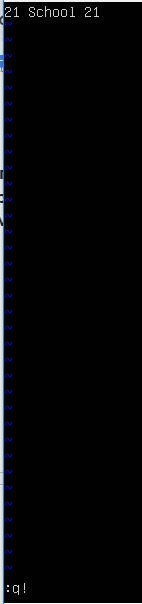

NANO: Ctrl+X

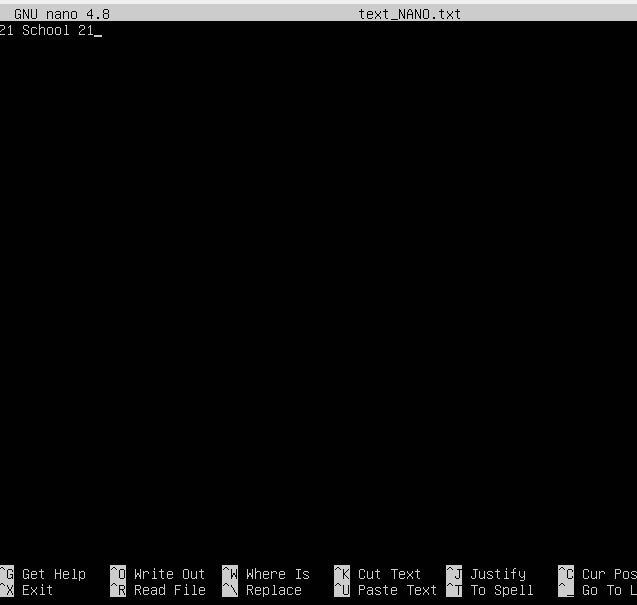

JOE: Ctrl+C

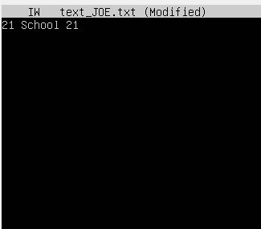

Используя каждый из трех выбранных редакторов, отредактируем файл ещё раз (по аналогии с предыдущим пунктом), а затем используем функции поиска по содержимому файла (слово) и замены слова на любое другое.
В отчёте скриншоты:
Из каждого редактора с результатами поиска слова. /Из каждого редактора с командами, введёнными для замены слова на другое.

VIM: /bool - найти слово bool
/%s/bool/stool - заменить на stool

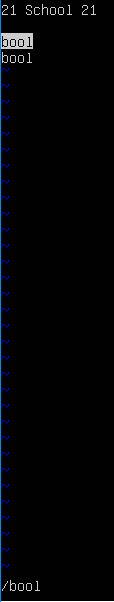 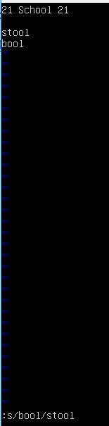

NANO: Ctrl+W - найти слово 
Ctrl+\ - заменить

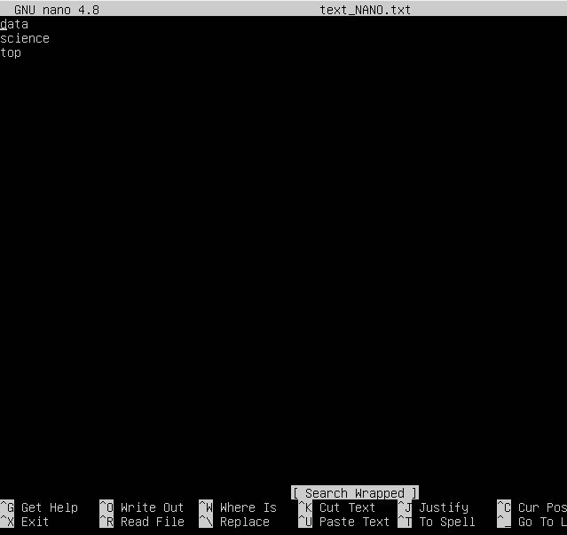 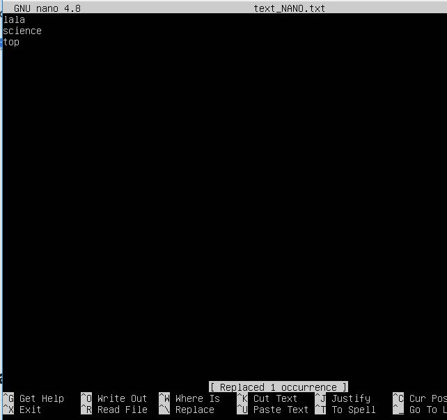

JOE: Ctrl+ KF, \<normal\> - найти 
r - заменить

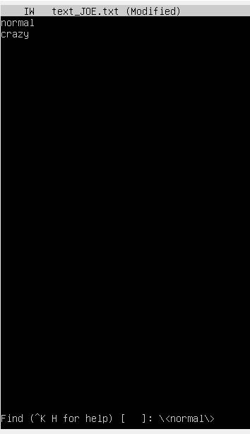 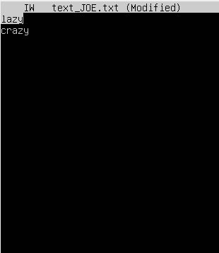

## Part 8. Установка и базовая настройка сервиса SSHD

Установка службы SSHd.

`sudo apt-get install ssh`

`sudo apt install openssh-server net-tools`

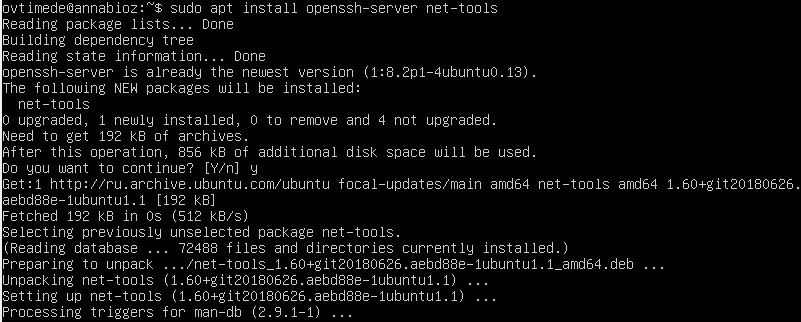

Добавление автостарта службы при загрузке системы.

`sudo systemctl enable ssh`

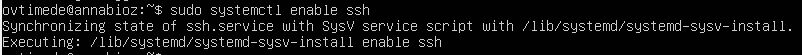

Перенастройка службы SSHd на порт 2022.

`sudo vim /etc/ssh/sshd_config`

В sshd_config заменяем порт 22 на 2022

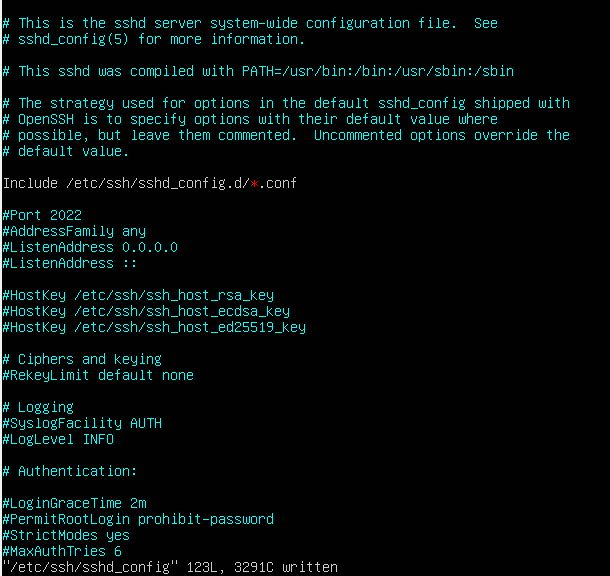

Процесс sshd, используя команду ps. Для этого к команде нужно подобрать ключи.

`ps -C sshd`

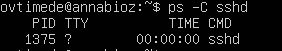

Значение команд:

ps -  (process status — «состояние процесса») используется для отображения информации о текущих процессах, выполняющихся в системе. 
-A, -e, (a) - выбрать все процессы;
-a - выбрать все процессы, кроме фоновых;
-d, (g) - выбрать все процессы, даже фоновые, кроме процессов сессий;
-N - выбрать все процессы кроме указанных;
-С - выбирать процессы по имени команды;
-G - выбрать процессы по ID группы;
-p, (p) - выбрать процессы PID;
--ppid - выбрать процессы по PID родительского процесса;
-s - выбрать процессы по ID сессии;
-t, (t) - выбрать процессы по tty;
-u, (U) - выбрать процессы пользователя.
Опции форматирования:

-с - отображать информацию планировщика;
-f - вывести максимум доступных данных, например, количество потоков;
-F - аналогично -f, только выводит ещё больше данных;
-l - длинный формат вывода;
-j, (j) - вывести процессы в стиле Jobs, минимум информации;
-M, (Z) - добавить информацию о безопасности;
-o, (o) - позволяет определить свой формат вывода;
--sort, (k) - выполнять сортировку по указанной колонке;
-L, (H)- отображать потоки процессов в колонках LWP и NLWP;
-m, (m) - вывести потоки после процесса;
-V, (V) - вывести информацию о версии;
-H - отображать дерево процессов;

Перезагрузка системы.

`systemctl restart sshd`

Вывод команды netstat -tan должен содержать
tcp 0 0 0.0.0.0:2022 0.0.0.0:* LISTEN.

`netstat -tan`

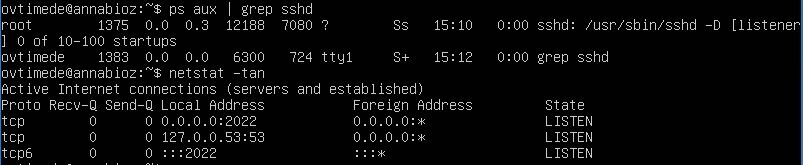

Опции netstat:

    -a 
    Показать сокеты, ожидающие подключения и не ожидающие подключения.

    -n
    Показывать числовые адреса, не пытаясь определить символьное имя узла, порт или имя пользователя.

    -t - Отображение текущего подключения в состоянии переноса нагрузки с процессора на сетевой адаптер при передаче данных.

- Значение каждого столбца вывода:

    - Proto: имя протокола

    - Local Address – IP-адрес локального компьютера и номер используемого порта.

    - Foreign Address – IP-адрес и номер порта удаленного компьютера, к которому подключен сокет. 

    - State – указывает состояние TCP-соединения.

    - Recv-Q - счётчик байт не скопированных программой пользователя из этого сокета.

    - Recv-Q - счётчик байт не скопированных программой пользователя из этого сокета.

## Part 9. Установка и использование утилит top, htop

Установка и запуск утилиты top и htop.

`sudo apt install htop`

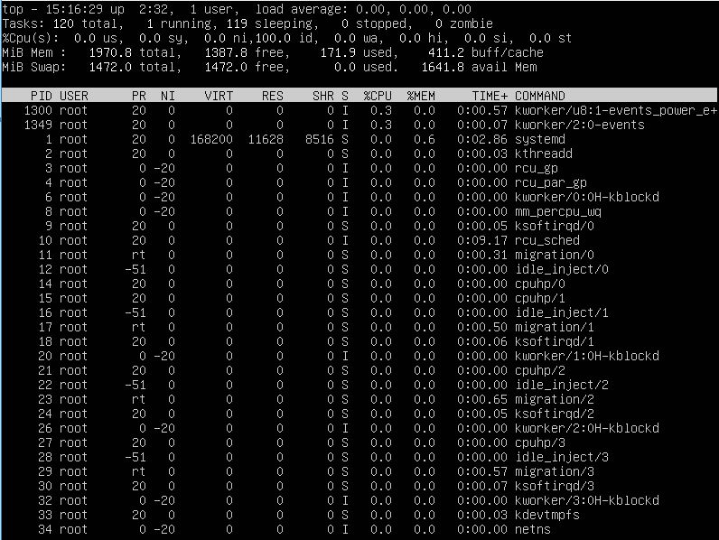

uptime: 2:32 ч

количество авторизованных пользователей: 1

среднюю загрузку системы: 0.01, 0.03, 0.06

общее количество процессов: 121

загрузку cpu:  0.0%

загрузку памяти: 170.7 из 1970.9

pid процесса занимающего больше всего памяти: 1

pid процесса, занимающего больше всего процессорного времени: 1167

В отчёте скрин с выводом команды htop:

отсортированному по PID:

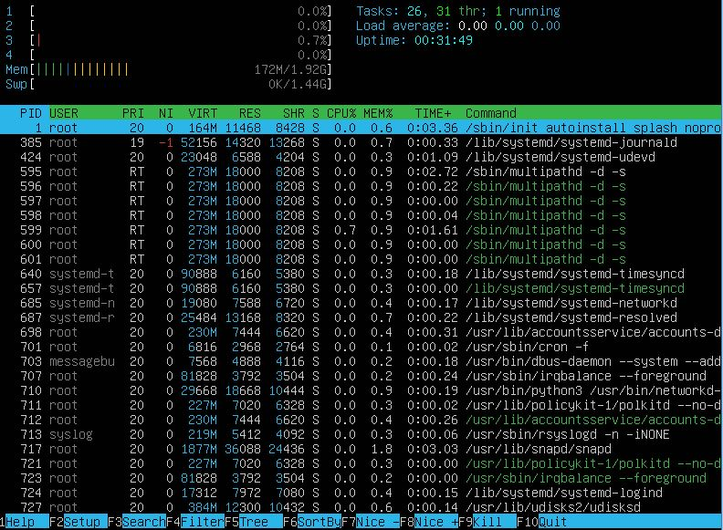

PERCENT_CPU:

PERCENT_MEM:

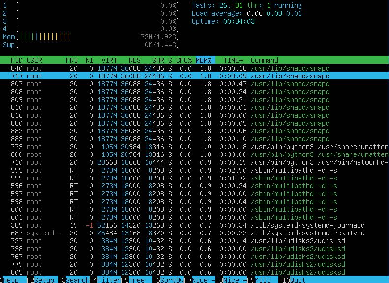

TIME:

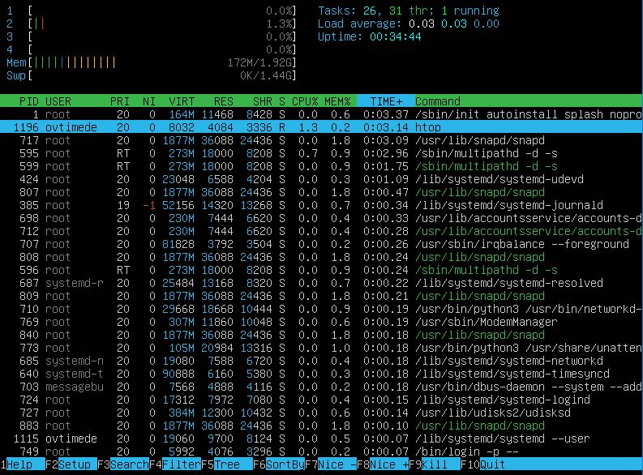

отфильтрованному для процесса sshd:

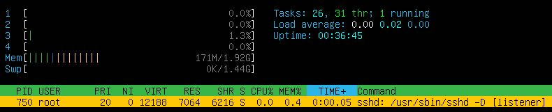

с процессом syslog, найденным, используя поиск;

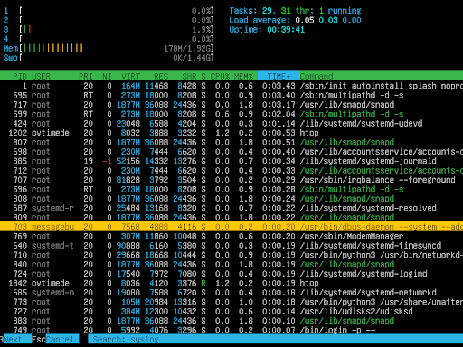

с добавленным выводом hostname, clock и uptime.

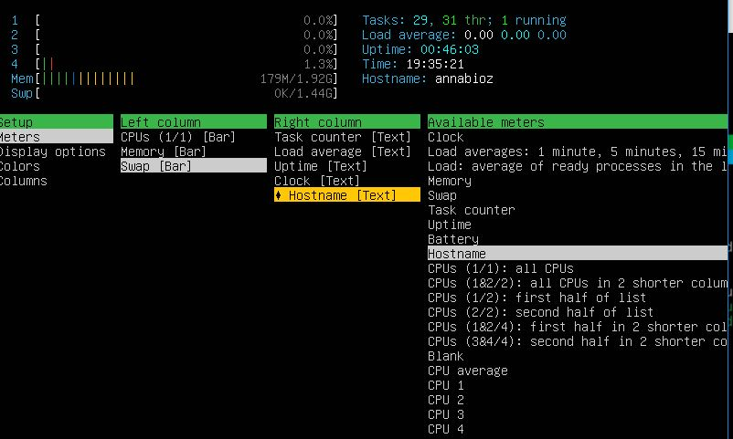

## Part 10. Использование утилиты fdisk

Запуск команды fdisk -l.

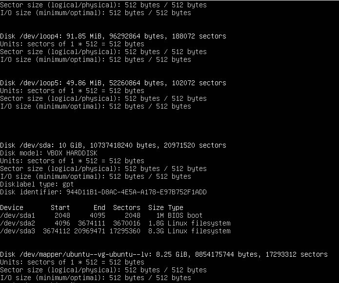

Название жесткого диска: VBOX HARDDISK

Размер жесткого диска: 10 GiB

Количество секторов: 20971520

Размер swap: 1.4G

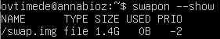

## Part 11. Использование утилиты df

Запуск команды df.

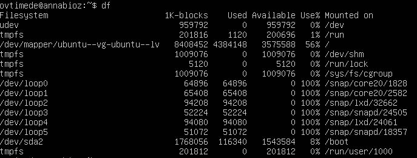

Для корневого раздела (/):

размер раздела: 8408452

размер занятого пространства: 4384148

размер свободного пространства 3575588

процент использования 56%

единица измерения в выводе: килобайт

Запуск команду df -Th.

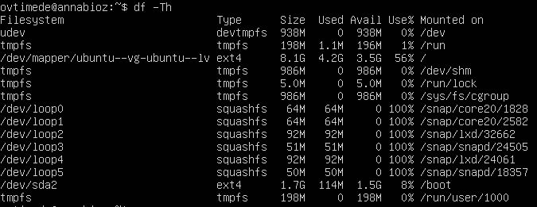

Для корневого раздела (/):

размер раздела: 8.1G

размер занятого пространства: 4.2G

размер свободного пространства: 3.5G

процент использования:56%

Тип файловой системы для раздела: ext4

## Part 12. Использование утилиты du

Запуск команды du.

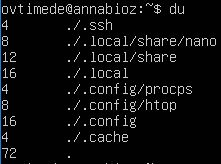

Размер папок /home, /var, /var/log (в байтах, в человекочитаемом виде):

Размер всего содержимого в /var/log (не общее, а каждого вложенного элемента, используя *):

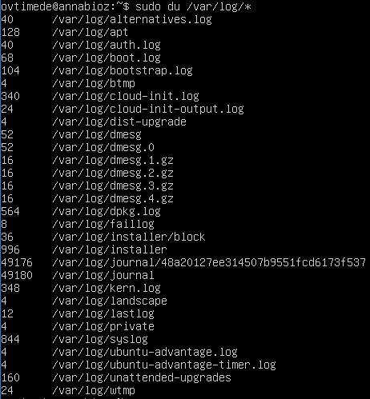

## Part 13. Установка и использование утилиты ncdu

Установка утилиты ncdu.

`sudo apt install ncdu`

Размер папок /home, /var, /var/log.

`ncdu /home`

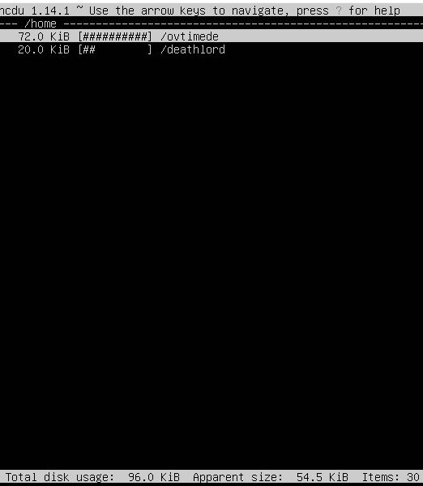 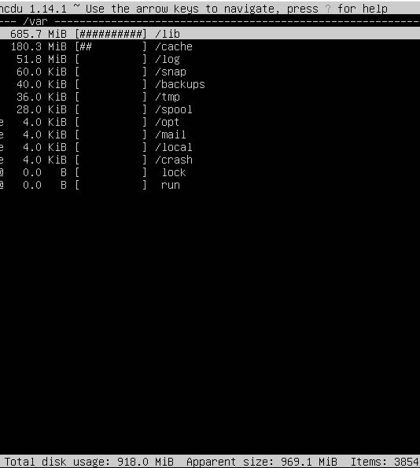

## Part 14. Работа с системными журналами

1. /var/log/dmesg

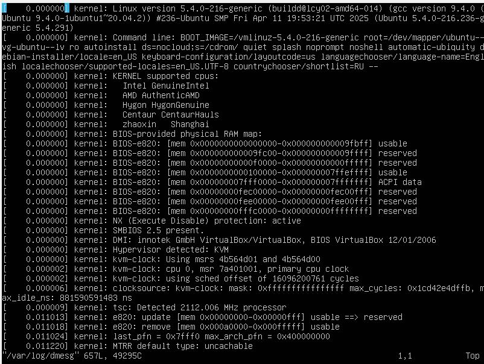

2. /var/log/syslog

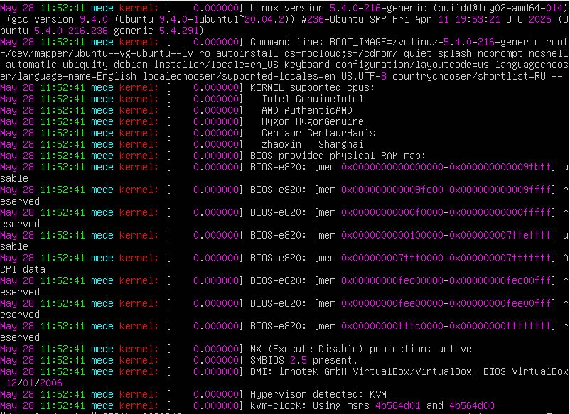

3. /var/log/auth.log

время последней успешной авторизации: May 28 11:53:24

имя пользователя: ovtimede

метод входа в систему: tty1

Перезапусти службу SSHd.

`sudo systemctl restart sshd.service`

Скрин с сообщением о рестарте службы (искать в логах):

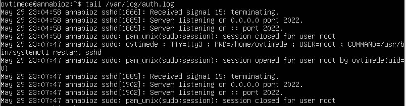

## Part 15. Использование планировщика заданий CRON

Запуск команды uptime через каждые 2 минуты, используя планировщик заданий.

`crontab -e`

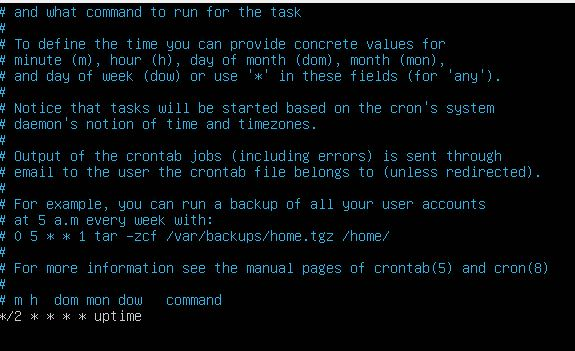

В системных журналах строчки (минимум две в заданном временном диапазоне) о выполнении.
Список текущих заданий для CRON.
Скрины со строчками о выполнении и списком текущих задач:

`crontab -l`

Удаление всех заданий из планировщика заданий.
Скрин со списком текущих заданий для CRON:

